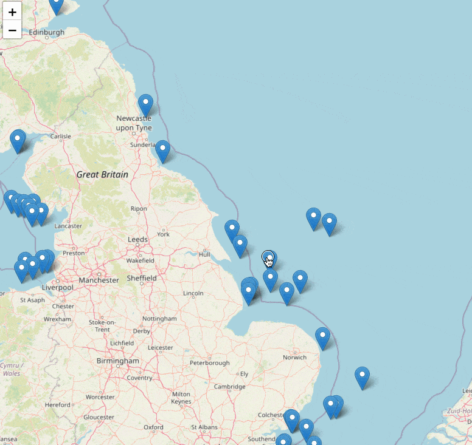

# CrateDB C# Offshore Wind Farms Demo Application

## Introduction

This ia a basic demo application that visualizes data in the UK Offshore wind farms example dataset.  Scroll around the map to see the locations of the wind farms and click on a marker to see details about that wind farm's performance.  Zoom in to see the boundaries of each wind farm as a polygon - click on that to display a pop up with additional data.  Finally, scroll in some more to see the locations of individual turbines.



Other resources that use this dataset include:

* A conference talk from the AI and Big Data Expo, Amsterdam 2024.  [Watch it on YouTube](https://www.youtube.com/watch?v=xqiLGjaTlBk).
* A Jupyter notebook that lets you explore the queries shown in the conference talk.  [Run it on Google Colab](https://github.com/crate/cratedb-examples/tree/main/topic/multi-model).
* The raw data for this dataset, as JSON files.  [Clone the GitHub repository](https://github.com/crate/cratedb-datasets/tree/main/devrel/uk-offshore-wind-farm-data).

## Prerequisites

To run this project you'll need to install the following software:

* .NET SDK ([download](https://dotnet.microsoft.com/en-us/download)) - we've tested this project with version 9.0 on macOS Sequoia.
* Git command line tools ([download](https://git-scm.com/downloads)).
* Your favorite code editor, to edit configuration files and browse/edit the code if you wish.  [Visual Studio Code](https://code.visualstudio.com/) is great for this.
* Access to a cloud or local CrateDB cluster (see below for details).

## Getting a CrateDB Database

You'll need a CrateDB database to store the project's data in.  Choose between a free hosted instance in the cloud, or run the database locally.  Either option is fine.

### Cloud Option

Create a database in the cloud by first pointing your browser at [`console.cratedb.cloud`](https://console.cratedb.cloud/).

Login or create an account, then follow the prompts to create a "CRFREE" database on shared infrastructure in the cloud of your choice (choose from Amazon AWS, Microsoft Azure and Google Cloud).  Pick a region close to where you live to minimize latency between your machine running the code and the database that stores the data. 

Once you've created your cluster, you'll see a "Download" button.  This downloads a text file containing a copy of your database hostname, port, username and password.  Make sure to download these as you'll need them later and won't see them again.  Your credentials will look something like this example (exact values will vary based on your choice of AWS/Google Cloud/Azure etc):

```
Host:              some-host-name.gke1.us-central1.gcp.cratedb.net
Port (PostgreSQL): 5432
Port (HTTPS):      4200
Database:          crate
Username:          admin
Password:          the-password-will-be-here
```

Wait until the cluster status shows a green status icon and "Healthy" status before continuing.  Note that it may take a few moments to provision your database.

### Local Option

The best way to run CrateDB locally is by using Docker.  We've provided a Docker Compose file for you.  Once you've installed [Docker Desktop](https://www.docker.com/products/docker-desktop/), you can start the database like this:

```bash
docker compose up
```

Once the database is up and running, you can access the console by pointing your browser at:

```
http://localhost:4200
```

Note that if you have something else running on port 4200 (CrateDB admin UI) or port 5432 (Postgres protocol port) you'll need to stop those other services first, or edit the Docker compose file to expose these ports at different numbers on your local machine.

## Creating the Database Tables

Now you have a database, you'll need to create the tables that this project uses.  Copy and paste the following SQL command into the database console, then execute it to create a table named `windfarms`. (If your database is in the Cloud, you can find the console in the menu to the left when logged in at `console.cratedb.cloud`. If you are running the database locally then go to `localhost:4200` and select the console icon from the left hand menu):

```sql
CREATE TABLE windfarms (
    id TEXT PRIMARY KEY,
    name TEXT,
    description TEXT INDEX USING fulltext WITH (analyzer='english'),
    description_vec FLOAT_VECTOR(2048),
    location GEO_POINT,
    territory TEXT,
    boundaries GEO_SHAPE INDEX USING geohash WITH (PRECISION='1m', DISTANCE_ERROR_PCT=0.025),
    turbines OBJECT(STRICT) AS (
        brand TEXT,
        model TEXT,
        locations ARRAY(GEO_POINT),
        howmany SMALLINT
    ),
    capacity DOUBLE PRECISION,
    url TEXT
);
```

Then copy and paste this statement into the console, and execute it to create a table named `windfarm_output`:

```sql
CREATE TABLE windfarm_output (
    windfarmid TEXT,
    ts TIMESTAMP WITHOUT TIME ZONE,
    month GENERATED ALWAYS AS date_trunc('month', ts),
    day TIMESTAMP WITH TIME ZONE GENERATED ALWAYS AS date_trunc('day', ts),
    output DOUBLE PRECISION,
    outputpercentage DOUBLE PRECISION
) PARTITIONED BY (day);
```

## Populating the Tables with Sample Data

Right now your database tables are empty.  Let's add some sample data!  Copy and paste the following SQL statement into the console then execute it to insert records for each windfarm into the `windfarms` table:

```sql
COPY windfarms                                 
FROM 'https://github.com/crate/cratedb-datasets/raw/main/devrel/uk-offshore-wind-farm-data/wind_farms.json'
RETURN SUMMARY;
```

Examine the output of this command once it's completed.  You should see that 45 records were loaded with 0 errors.

Next, let's load the sample power generation data into the `windfarm_output` table.  Copy and paste this SQL statement into the console, then execute it:

```sql
COPY windfarm_output
FROM 'https://github.com/crate/cratedb-datasets/raw/main/devrel/uk-offshore-wind-farm-data/wind_farm_output.json.gz' 
WITH (compression='gzip')
RETURN SUMMARY;
```

Examine the output of this command once it's completed.  You should expect 75,825 records to have loaded with 0 errors.

## Getting the Code

Next you'll need to get a copy of the code from GitHub by cloning the repository.  Open up your terminal and change directory to wherever you store coding projects, then enter the following commands:

```bash
git clone https://github.com/crate/devrel-offshore-wind-farms-demo.git
```

This creates a new folder named `devrel-offshore-wind-farms-demo`.  You'll need to change directory as follows before running the project.

```bash
cd devrel-offshore-wind-farms-demo/OffshoreWindFarmsDemo
```

## Configuring the Database Connection

You'll need to configure the project to talk to your CrateDB database.  How you do this depends on whether you chose the cloud or local option...

### Cloud Option

Use your text editor / IDE to open the file `appsettings.json`.

The file's contents should look like this:

```json
{
  "Logging": {
    "LogLevel": {
      "Default": "Information",
      "Microsoft.AspNetCore": "Warning"
    }
  },
  "ConnectionStrings": {
    "CrateDB": "Host=127.0.0.1;Username=crate;Password=;Database=doc"
  },
  "AllowedHosts": "*"
}
```

Edit the value of the key `CrateDB` in the `ConnectionStrings` object. Make the following changes:

* Replace `Host=127.0.0.1` with the hostname of your cloud database (example: `Host=my-cluster.gke1.us-central1.gcp.cratedb.net`).
* Replace `Username=crate` with `Username=admin`.
* Replace `Password=` with the password for yuour cloud database (example `Password=sdfW234fwfTY^f`).

Save your changes.

### Local Option

The project comes pre-configured to expect CrateDB to be at `127.0.0.1:5432` so there's nothing to do here (unless you changed the port in the Docker Compose file). Our Docker Compose file exports port 5432 from the container, so simply carry on to the next step :)

If you changed the port in the Docker Compose file (for example because you are also running Postgres locally on port 5432), then you'll need to edit `appsettings.Development.json` and change `Host=127.0.0.1` to reflect your updated port number (example: `Host=127.0.0.1:6666`).  Be sure to save your changes before continuing.

## Running the Project

There are two ways to start the application.  If you are planning to modify the source code and want the server to live reload when you save a source file, use this:

```bash
dotnet watch
```

If you just want to run the server and aren't planning to edit the source code, start it like this:

```bash
dotnet run
```

Once you have the server running, point your browser at port 5213 and you should see the map front end:

```
http://localhost:5213/
```

## Interacting with the Project

TODO details of how to interact with the project, maybe with images?

## Shutting Down

To stop the application, press `Ctrl-C` in the terminal window that you started it from.

If you're using Docker to run CrateDB, stop the container like so:

```bash
docker compose down
```

## Understanding the Code

TODO introduction.

### Server Code

TODO.

### Front End Code

TODO.

## CrateDB Academy

Want to learn more about CrateDB?  Take our free online "CrateDB Fundamentals" course, available now at the [CrateDB Academy](https://cratedb.com/academy/fundamentals/).
