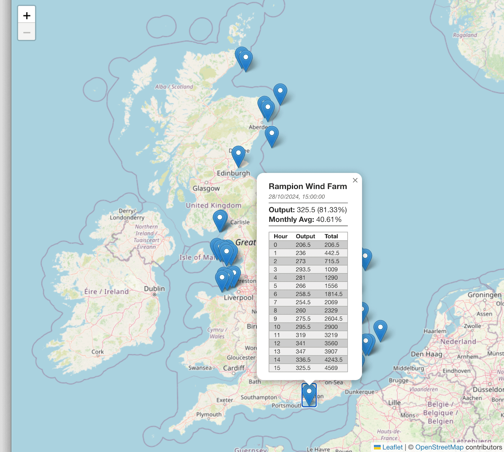

# CrateDB Offshore Wind Farms Demo: Java

## Introduction

Follow the instructions below to configure and run the Java implementation of this project.  You'll need to have completed the instructions in the [main README](../README.md) first and should have created a CrateDB database and loaded the example data into it.

## Configuring the Database Connection

You'll need to configure the project to talk to your CrateDB database.  

The first step is to create a `config.yml` file in which to store your database credentials:

```bash
cd java
cp config_example.yml config.yml
```

The next step depends on whether you chose the cloud or local option...

### Cloud Option

Use your text editor / IDE to open the file `config.yml`.

Find the `database` section, which looks like this:

```
database:
  # the name of your JDBC driver
  driverClass: org.postgresql.Driver

  # the username
  user: crate

  # the password
  password: 

  # the JDBC URL
  url: jdbc:postgresql://localhost/doc

...
```

Make the following changes:

* Change the value of `user` from `crate` to `admin`.
* Set the value of `password` to be the password for your cloud instance.
* Set the value of `url` to be `jdbc:postgresql://hostname/doc` where `hostname` is the host for your cloud instance.

For example, if your host name is `my-cluster.gke1.us-central1.gcp.cratedb.net` then your URL should look like this:

```
jdbc:postgresql://my-cluster.gke1.us-central1.gcp.cratedb.net/doc
```

Save your changes.  Remember not to commit `config.yml` to source control as you should consider your database credentials as a secret.

### Local Option

The project comes pre-configured to expect CrateDB to be running with the default configuration on localhost, so there's nothing to do here.

## Compiling and Packaging the Project

Use the following Maven command to compile and package the project into a single executable Jar file:

```bash
mvn clean package
```

## Running the Project

Start the application like this:

```bash
java -jar target/windfarms-1.0-SNAPSHOT.jar server windfarms.yml
```

Once you have the server running, point your browser at port 8080 and you should see the map front end:

```
http://localhost:8080/
```

## Interacting with the Project

When the project is first loaded, it displays a map of the UK with a blue marker for each wind farm.  Click on one of these markers to show a pop-up containing details about that wind farm's latest and monthly average outputs, as well as a table with the running total of the output for each hour of the most recent day in the dataset.



Next, zoom in a bit until the wind farm markers are replaced with polygons showing the boundaries of each wind farm.  Click on one of the polygons to see a marker containing data about the maximum output of the wind farm for the 10 most recent days in the dataset.


Finally, zoom in some more to see the locations of individual turbines in the wind farms.  These markers are not clickable.


## Try out the API Calls

You can see the raw that that the front end uses by visiting the API URLs whilst the application is running:

* When the page initially loads, it calls this endpoint to get data about all of the wind farms:

`http://localhost:8080/api/windfarms`

* Clicking on a wind farm marker on the map loads additional data for that wind farm, using the wind farm's ID.  Here's an example for North Hoyle (`NHOYW-1`): 

`http://localhost:8080/api/latest/NHOYW-1`

* When you click on a wind farm marker, the average output percentage for the month is returned from this endpoint.  The parameters are the wind farm ID (`NHOY-1` here) and the timestamp for the 1st of the month (`1727740800000` here).  Example: 

`http://localhost:8080/api/avgpctformonth/NHOYW-1/1727740800000`

* Cumulative output for the most recent day in the dataset is also displayed when you click on a wind farm marker. Parameters for this endpoint are also the wind farm ID (`NHOY-1` here) and the timestamp for midnight for the day you want data for (`1730073600000` here). Example: 

`http://localhost:8080/api/outputforday/NHOYW-1/1730073600000`

* Clicking on the polygon for a wind farm loads further data for that wind farm, showing the maximum output percentage for a number of days.  Here's an example for Teeside (`TEES-1`) for 10 days:

`http://localhost:8080/api/dailymaxpct/TEES-1/10`

## Shutting Down

To stop the application, press `Ctrl-C` in the terminal window that you started it from.

If you're using Docker to run CrateDB, stop the container like so:

```bash
docker compose down
```
